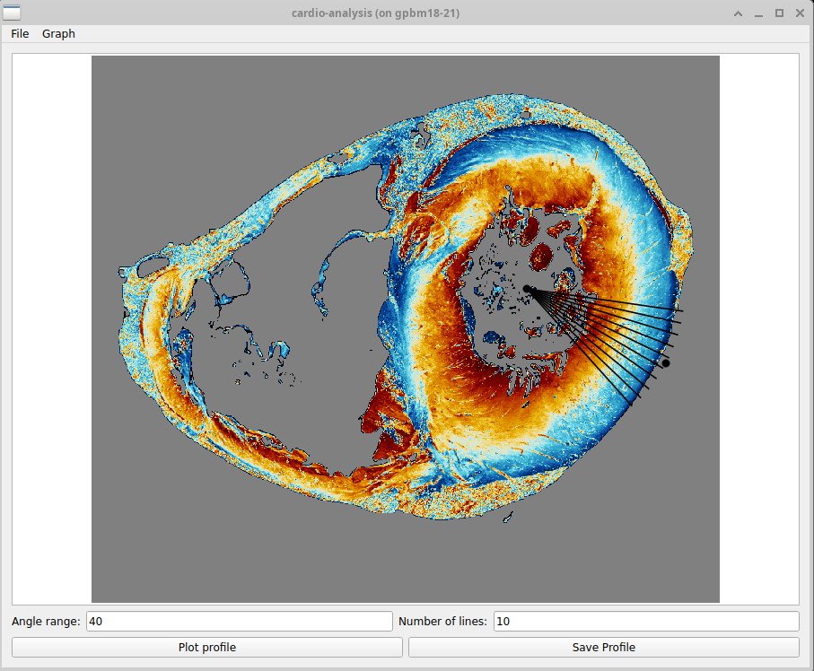
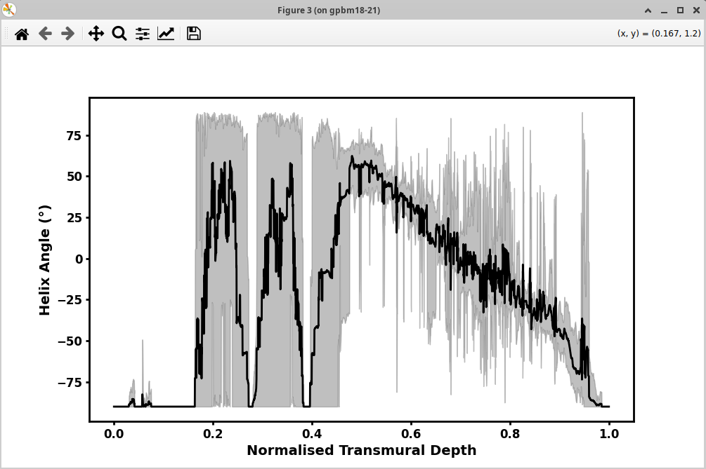
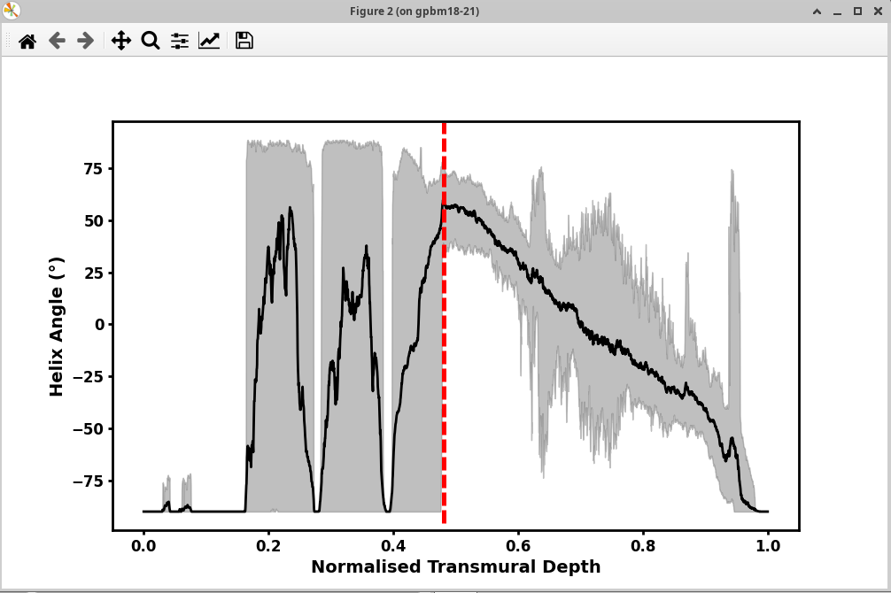

# Transmural Analysis

Use `cardio-analysis` to extract transmural profiles from angle and FA maps generated by `cardio-tensor`.

## Before You Start

- In the config file, set `WRITE_ANGLES = True` and `TEST = False`.
- Run `cardio-tensor` on your dataset.
- Make sure outputs exist in `OUTPUT_PATH`:
    - `HA`, `IA` if `ANGLE_MODE = ha_ia`
    - `EL`, `AZ` if `ANGLE_MODE = az_el`
    - `FA`

## Run the Tool

```console
$ cardio-analysis ./parameters_example.conf
```

Useful options:

- `--N-slice`: slice index to open first.
- `--N-line`: number of sampled lines (default: `5`).
- `--angle-range`: angular spread in degrees (default: `20`).
- `--image-mode`: map shown first (`HA`, `IA`, `EL`, `AZ`, `FA`), depending on available outputs.

## Quick Workflow

1. Choose a slice with a clear myocardium wall.
2. Click and drag from endocardium to epicardium.
3. Set `Angle range` and `Number of lines`.
4. Click `Plot profile` to see the transmural plot.
5. Click `Save Profile` to export CSV.

<figure markdown="span">
{ width="70%" }
<figcaption>Main GUI for profile definition and plotting. 
</figcaption>
</figure>

The dataset used as an example here can be find at [DOI](https://doi.org/10.15151/esrf-dc-1634390196)

!!! warning

    Choose the beginning and end of the line carefully. If the path includes trabeculae, cavity, or epicardium borders, the profile can be biased and difficult to interpret.

## What the Plot Represents

- X-axis: normalized transmural depth.
- Y-axis: selected map value (`HA`/`IA` or `EL`/`AZ`, plus `FA`).
- Multiple lines are averaged to get a smoother profile.
- The 5 and 95 percentiles are plotted as a gray region around the average curve.

## Example: Effect of Number of Lines

With 10 lines:

<figure markdown="span">
{ width="75%" }
<figcaption>Profile computed with low line count (more local variability).</figcaption>
</figure>

With 500 lines:

<figure markdown="span">
{ width="75%" }
<figcaption>Profile computed with high line count (smoother average). The vertical red line shows where the compact myocardium starts.</figcaption>
</figure>


## Tips

- Increase number of lines for smoother curves.
- If the curve looks unstable, move the line to a cleaner wall region and re-plot.
- Use the menu bar to change slice, switch map, and set plot limits.
