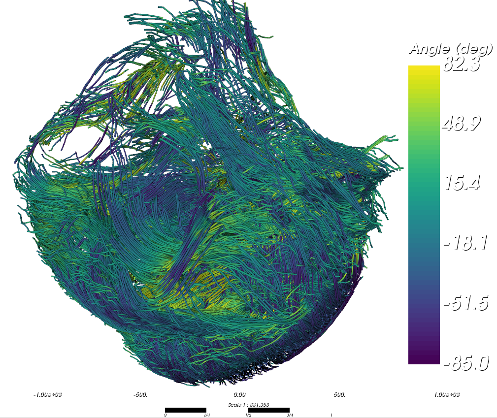

# Streamlines

Use this page to generate and inspect 3D streamlines with:

- `cardio-generate-streamlines`
- `cardio-visualize-streamlines`

## Before You Start

- In the config file, set `WRITE_VECTORS = True` and `TEST = False`.
- Run `cardio-tensor` on your full dataset.
- Make sure these outputs exist in `OUTPUT_PATH`:
    - `eigen_vec/`
    - `FA/`
    - angle folders (`HA`/`IA` or `AZ`/`EL`, depending on `ANGLE_MODE`)

!!! note

    It is usefull to provide a `MASK_PATH` to avoid placing seeds and tracing streamline outside the sample, even though the FA threshold should avoid this.


## Generate Streamlines

Basic example:

```console
$ cardio-generate-streamlines ./parameters_example.conf 
```

Useful options:

- `--seeds`: number of seeds (default: 20000).
- `--fa-seed-min`: minimum FA to place seeds (default: 0.2).
- `--fa-threshold`: minimum FA to continue tracking (default: 0.1).
- `--angle`: maximum turning angle (degrees - default: 60.0).
- `--step`: integration step length (voxels - default: 0.5).
- `--min-len`: minimum streamline length (points - default: 10).
- `--bin`: downsampling factor for faster processing.
- `--start-z/--end-z` (and `x`, `y` variants): process only a sub-volume.

Generated files:

- `OUTPUT_PATH/streamlines.trk`


!!! note

    Use `--bin` if the dataset is too big to fit in RAM. This will bin the eigenvectors and the maps.

## Visualize Streamlines

```console
$ cardio-visualize-streamlines ./parameters_example.conf --downsample 5
```

Useful options:

- `--color-by`: `auto`, `elevation`, or stored fields like `HA`, `IA`, `AZ`, `EL`.
- `--list-color-by`: list available fields in the `.trk`.
- `--line-width`: tube width.
- `--subsample`: keep every Nth streamline.
- `--min-length`: filter short streamlines.
- `--crop-x`, `--crop-y`, `--crop-z`: spatial crop ranges.
- `--screenshot`: save a PNG snapshot.

!!! note

    Use `--downsample` to keep fewer points per streamline and improve rendering performance on large datasets.

<figure markdown="span">
{ width="75%" }
<figcaption>Example 3D streamline rendering in a human heart.</figcaption>
</figure>

The dataset used as an example here can be find at [DOI](https://doi.org/10.15151/esrf-dc-1634390196)


## Keybindings

In the interactive viewer:

- `O`: toggle clipping plane on/off.
- `H`: show/hide clipping plane gizmo.
- `I`: flip clipping plane normal.
- `R`: reset clipping plane to center.
- `+` / `-`: increase/decrease streamline thickness.
- `B`: toggle background color (black/white).
- `S`: show/hide scale bar.
- `P`: save a high-resolution PNG snapshot.

!!! Note

    During interaction (rotate/pan/zoom), the viewer switches to a low-resolution for better responsiveness, then automatically returns to full resolution when interaction ends.

<figure markdown="span">
{ width="75%" }
<figcaption>Example 3D streamline rendering in a human heart, cropped using the clipping plane.</figcaption>
</figure>


## Quick Tuning Workflow

1. Start with `--seeds 10000`.
2. Check global coverage and continuity.
3. Increase `--seeds` if regions are undersampled.
4. Increase `--fa-threshold` or decrease `--angle` to reduce implausible curves.
5. Use `--subsample` and `--downsample` for faster visual inspection.

!!! warning

    Interpretation depends strongly on tracking parameters. Compare conditions only when parameters, such as seeding and thresholds, are similar.

